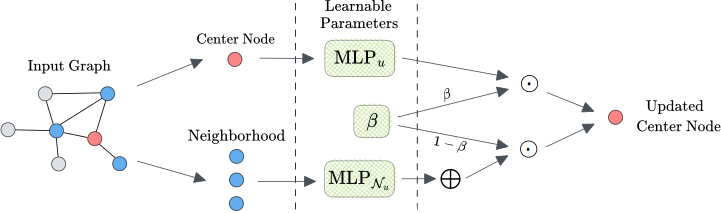

# GCNH: A Simple Method For Representation Learning On Heterophilous Graphs

This repository contains the implementation of GCNH, the model described in our work *GCNH: A Simple Method For Representation Learning On Heterophilous Graphs*, accepted at IJCNN 2023 ([preprint](https://arxiv.org/abs/2304.10896)). 

## Description

GCNH extends GNNs' representation capabilities on heterophilous graphs by learning two different functions to encode center node and neighborhood messages. These two encoding are merged into the final node embedding using a balancing coefficient β. In this way, the model can flexibly choose to assign more or less importance to the neighborhood, depending on how informative it is. Our experiments show that GCNH achieves state-of-the-art performance on 4 out of the 8 graph datasets used.

  

## Usage

The folder `experiments` contains the commands to reproduce the results of the main table of the paper and to test GCNH on the synthetic dataset used in the paper.

## Contributors

- [Andrea Cavallo](https://github.com/andrea-cavallo-98)
- [Michele Russo](https://github.com/mik1904)

## Citation

If you find this code useful, please cite

```
@INPROCEEDINGS{Cava2306:GCNH,
AUTHOR="Andrea Cavallo and Luca Vassio and Claas Grohnfeldt and Michele Russo and Giulio Lovisotto",
TITLE="{GCNH:} A Simple Method for Representation Learning on Heterophilous Graphs",
BOOKTITLE="2023 International Joint Conference on Neural Networks (IJCNN) (IJCNN 2023)",
ADDRESS="Queensland, Australia",
PAGES=8,
DAYS="17",
MONTH=jun,
YEAR=2023,
}
```
